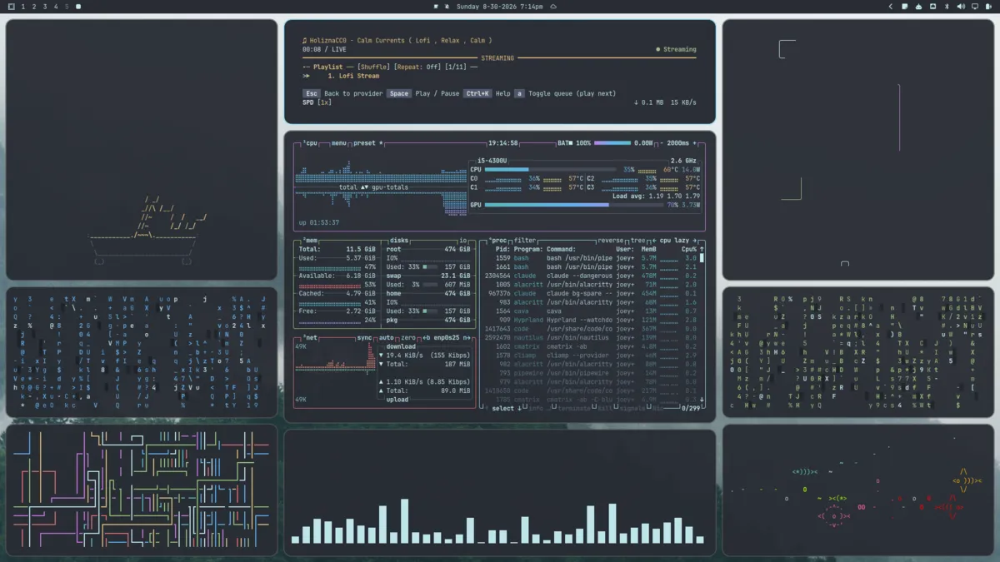

# dionysus — an Omarchy theme

A dark Omarchy theme derived from [pewdiepie-archdaemon/dionysus](https://github.com/pewdiepie-archdaemon/dionysus),
a Hyprland rice for Arch Linux. The rice is a One Dark / Nord hybrid keyed on a
neon pale cyan (`#9cdef2`), and this theme carries that palette into every
surface Omarchy themes: terminal, bar, menus, lock screen, btop, Helix, Neovim,
and VS Code.



## Install

```sh
omarchy theme install https://github.com/joeyvigil/omarchy-dionysus-theme.git
```

That is all most people need — it clones the theme, names it `dionysus`, and
applies it.

Omarchy will print that it ignored `neovim.lua` and `vscode.json`. That is
expected, and it is not a downgrade. A theme installed from a git repo may not
ship files that run code, so Omarchy generates its own Neovim and VS Code
themes from `colors.toml` instead. Those are built from the palette directly,
so they match it more exactly than the two files in this repo do — those point
at published One Dark themes, which have no neon cyan.

### Hacking on it

Symlink it instead if you want to edit the theme and see changes live. Omarchy
treats a symlinked theme as one you wrote yourself and stages every file,
including `neovim.lua` and `vscode.json`:

```sh
git clone https://github.com/joeyvigil/omarchy-dionysus-theme.git
ln -s "$PWD/omarchy-dionysus-theme" ~/.config/omarchy/themes/dionysus
omarchy theme set dionysus
```

## Credits

Palette derived from [pewdiepie-archdaemon/dionysus](https://github.com/pewdiepie-archdaemon/dionysus)
by pewdiepie-archdaemon. Structured for [Omarchy](https://omarchy.org).

### Background artwork

None of the backgrounds are the work of this theme's author.

- `3-mist-spheres.jpg` and `4-tower-blocks.jpg` are paintings by
  **[Simon Stålenhag](https://simonstalenhag.se/)**. Rights are his. Please buy
  his books.
- `2-street-power-lines.png` and `5-watchtower.png` come from
  [dharmx/walls](https://github.com/dharmx/walls), which does not record their
  authors. Rights remain with whoever made them.
- `1-dionysus.png` is cropped from a screenshot in the upstream dionysus repo.
  The photographer is unidentified.

If you hold rights to any image here and want it removed, open an issue and it
will be deleted promptly — no argument, no delay.

Prefer to install without any of it? Delete `backgrounds/` before running
`omarchy theme set`; the theme works fine with an empty background directory,
and you can add your own with `omarchy theme bg install`.
